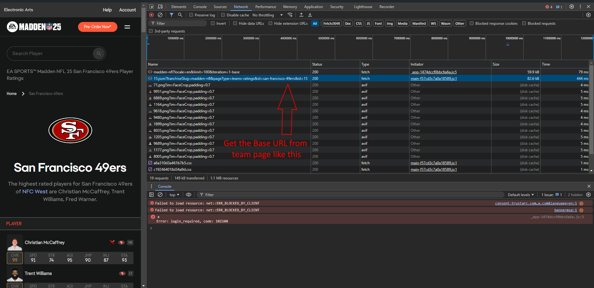
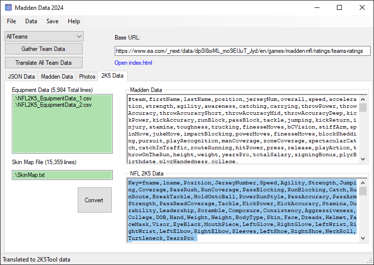

Created due to a Data format change for Madden's website.

Operation:
1. Goto  'MaddenData2024\bin\debug'
2. Run 'MaddenDataScraper_2024.exe' 
3. Goto madden website 'https://www.ea.com/games/madden-nfl' to figure out a valid 'base url' (it changes)

4. Enter a valid base url into the 'Base URL' textbox.
5. Press 'Gather All Team Data' (folder at bin\Debug\RawTeamData\ should be populated with the JSON data)
   Note: If you already have downloaded the data and want to download for a new week, either delete or 
   rename the 'RawTeamData' folder ('RawTeamData_weekX') if you'd like to save it.
6. Press 'Translate All Team Data' (Textbox in 'Madden Data' tab is populated)
7. File -> Trim Teams  (Trim teams how you like); Close/Ok
8. Copy NFL2K5 Data from the '2K5 Data Tab'

